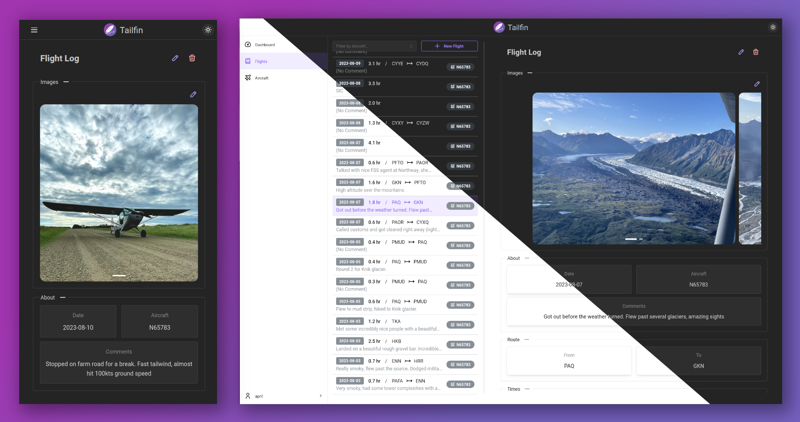

<p align="center">
    <a href="" rel="nooperner">
    </a>
</p>

<h1 align="center">Tailfin</h2>

<h3 align="center">A self-hosted digital flight logbook</h3>



<p align="center">
    <a href="https://python.org/"></a>
    <a href="https://www.mongodb.com/"></a>
    <a href="https://fastapi.tiangolo.com/"></a>
    <a href="https://www.typescriptlang.org/"></a>
    <a href="https://react.dev/"></a>
    <a href="https://remix.run/"></a>
    <a href="https://tanstack.com/query/latest/"></a>
</p>
<p align="center">
    <a href="LICENSE"></a>
</p>

## Table of Contents

- [About](#about)
- [Getting Started](#getting_started)
  - [Docker](#docker)
  - [From Source](#from_source)
- [Configuration](#configuration)
- [Roadmap](#roadmap)

## About <a name="about"></a>

Tailfin is a digital flight logbook designed to be hosted on a personal server, computer, or cloud solution.

I created this because I was disappointed with the options available for digital logbooks. The one provided by
ForeFlight is likely most commonly used, but my proclivity towards self-hosting drove me to seek out another solution.
Since I could not find any ready-made self-hosted logbooks, I decided to make my own.

#### :warning: This project is still in active development and may be subject to breaking changes! :warning:
That said, it is functional in its current state and I have been using it to log my flights, including 
a recent trip from Minnesota to Alaska (shown in the screenshots above), which served as an extensive 
test of its functionanlity.

## Getting Started <a name="getting_started"></a>

### Docker <a name="docker"></a>

|:exclamation: Warning :exclamation: |
|---------------------------------|
| Docker builds are considered unstable at this point and cannot be guaranteed to work without customization. Proceed at your own risk |

1. Clone the repo

```
$ git clone https://git.github.com/azpsen/tailfin.git
$ cd tailfin
```

2. Configure `docker-compose.yml` and `.env`

3. Build/pull the images and start the service

```
$ docker compose build
$ docker compose pull
$ docker compose up -d
```

4. Log in to the web UI at `localhost:3000`

### From Source <a name="from_source"></a>

#### Prerequisites <a name="prerequisites"></a>

- nodejs
- npm
- python 3.11
- mongodb 7.0.4

#### Installation <a name="installation"></a>

##### 1. Clone the repo

```
$ git clone https://git.github.com/azpsen/tailfin.git
$ cd tailfin
```

##### 2. Set up database

[Install MongoDB](https://www.mongodb.com/docs/manual/installation/)

[Enable Authentication](https://www.geeksforgeeks.org/how-to-enable-authentication-on-mongodb/)

Add the `tailfin` user:

```
$ mongosh -u "yourAdminUsername" -p
> use tailfin
> db.createUser(
    {
        user: "tailfin-api",
        pwd: "tailfin-api-password", // or passwordPrompt() for secure entry
        db: "tailfin",
        roles: [ { role: "readWrite", db: "tailfin" } ]
    }
)
```

##### 3. Set up backend

```
$ cd api
```

(Optional) Create and activate python virtual environment:

```
$ python -m venv tailfin-env
$ source 
```

Install python requirements:

```
$ pip install -r requirements.txt
```

[Configure the backend](#backend_configuration)

##### 4. Set up frontend

Install NPM requirements:

```
cd ../web
$ npm install
```

Build and run the web app:

```
$ npm run build && npm run start
```

5. Access the web UI at `localhost:3000`

## Configuration <a name="configuration"></a>

The URL for connecting to the Tailfin API from the Web UI can be set with the environment variable `TAILFIN_API_URL`. It defaults to `http://localhost:8081`, which assumes the API runs on the same machine and uses the default port.

### Backend <a name="backend_configuration"></a>


To configure Tailfin, modify the `.env` file. Some of these options should be changed before running the server. All
available options are detailed below:

`DB_URI`: Address of MongoDB instance. Default: `localhost`
<br />
`DB_PORT`: Port of MongoDB instance. Default: `27017`
<br />
`DB_NAME`: Name of the database to be used by Tailfin. Default: `tailfin`

`DB_USER`: Username for MongoDB authentication. Default: `tailfin-api`
<br />
`DB_PWD`: Password for MongoDB authentication. Default: `tailfin-api-password`

`REFRESH_TOKEN_EXPIRE_MINUTES`: Duration in minutes to keep refresh token active before invalidating it. Default:
`10080` (7 days)
<br />
`ACCESS_TOKEN_EXPIRE_MINUTES`: Duration in minutes to keep access token active before invalidating it. Default: `30`

`JWT_ALGORITHM`: Encryption algorithm to use for access and refresh tokens. Default: `HS256`
<br />
`JWT_SECRET_KEY`: Secret key used to encrypt and decrypt access tokens. Default: `please-change-me`
<br />
`JWT_REFRESH_SECRET_KEY`: Secret key used to encrypt and decrypt refresh tokens. Default: `change-me-i-beg-of-you`

`TAILFIN_ADMIN_USERNAME`: Username of the default admin user that is created on startup if no admin users exist.
Default: `admin`
<br />
`TAILFIN_ADMIN_PASSWORD`: Password of the default admin user that is created on startup if no admin users exist.
Default: `change-me-now`

`TAILFIN_PORT`: Port to run the local Tailfin API server on. Default: `8081`

Once the backend is running, full API documentation is available at `localhost:8081/docs`

## Roadmap <a name="roadmap"></a>

- [x] Create, view, edit, and delete flight logs
- [x] Aircraft managment and association with flight logs
- [x] Dashboard with statistics
- [x] Attach photos to log entries
- [ ] Import from other log applications (partially working for MyFlightBook)
- [ ] Admin dashboard to manage all users and server configuration
- [ ] GPS track recording and map display
- [ ] Calendar view
- [ ] PDF Export
- [ ] Integrate database of airports and waypoints that can be queried to find nearest
